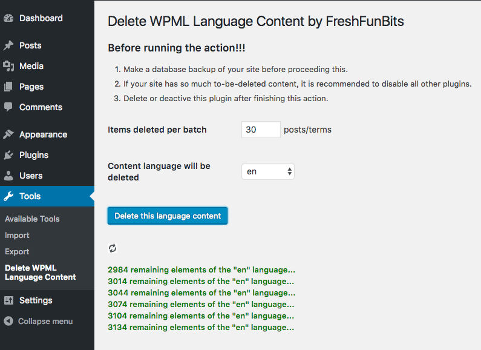

# Delete WPML Language Content by FreshFunBits

Remove any language content on your WPML site. It is useful when you no longer want the content of a specific language.

## Description

This small plugin removes any language content on your WPML site. This plugin works fine with all WPML versions since its idea is based on the [WPML's Tables](https://wpml.org/documentation/support/wpml-tables/) official guide.

Official repo on WordPress.org: https://wordpress.org/plugins/ffb-delete-wpml-language-content/

Features:

* Remove the content of a specific language completely.
* Have the option to choose `Items deleted per batch`, make sure your site will not be crashed.
* Work independently with WPML.

You can report bugs or contribute code on [this GitHub repo](https://github.com/FreshFunBits/ffb-delete-wpml-language-content).

## Installation

Follow these steps to install and use the plugin:

1. Upload the plugin files to the `/wp-content/plugins/ffb-delete-wpml-language-content` directory, or install the plugin through the WordPress plugins screen directly.
1. Activate the plugin through the 'Plugins' screen in WordPress.
1. Go to `Tools -> Delete WPML Language Content` screen and start the deleting action.

## Frequently Asked Questions

### To use this plugin, do I need to enable WPML plugins?
No. It works dependently.

### If my site has too much content, will it be crashed when using this plugin?
No. Have the option to choose `Items deleted per batch`.

### Should I keep this plugin after deleting a language content?
No. You should deactivate or delete the plugin after using the plugin.

### Which WPML versions does this plugin support?
In short, all WPML versions. Because its idea is based on the [WPML's Tables](https://wpml.org/documentation/support/wpml-tables/) official guide, which has not changed for a long time.

## Screenshots

## Changelog

### 0.2
* Fixed: Delete terms by using `term_taxonomy_id` rather than `term_id`
* Test with WordPress 4.7

### 0.1.1 
* Minor update: some texts only.

### 0.1
* The first release.